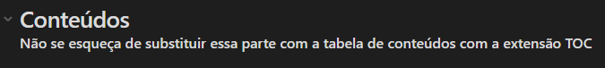

- [Como utilizar este repositório](#Como%20utilizar%20este%20reposit%C3%B3rio)
- [Usando plugins](#Usando%20plugins)
	- [Templates](#Templates)
	- [[Obsidian Git](https://publish.obsidian.md/git-doc/Start+here)](#%5BObsidian%20Git%5D(https://publish.obsidian.md/git-doc/Start+here))
	- [[Table of Contents](https://github.com/hipstersmoothie/obsidian-plugin-toc)](#%5BTable%20of%20Contents%5D(https://github.com/hipstersmoothie/obsidian-plugin-toc))

## Como utilizar este repositório
1. Tenha um tema em mente (não necessariamente um título, mas sobre o que você quer escrever)
2. Utilize os templates dentro da pasta `templates`
	- Para utilizar alguns plugins como o TOC (Table Of Contents) e Obsidian Git, veja as instruções dos [plugins](#usando-plugins)

## Usando plugins

> Abra a paleta de comandos do Obsidian (`Ctrl + P` ou clique em `Open command palette` na barra lateral)
### Templates
1. Crie um novo arquivo `Ctrl + N` (Ou clique em `New note`) e insira o nome do arquivo
2. Utilize a paleta de comandos: `Templates: Insert template`
3. Selecione `novo post`
4. Escreva o post 👍
### Obsidian Git
0. [Link do plugin](https://publish.obsidian.md/git-doc/Start+here)
1. Primeiro, instale e configure [Git](https://git-scm.com/) na sua máquina
2. Para sincronizar com o servidor: escolha `Obsidian Git: Pull`
3. Para salvar as alterações localmente:
	- Faça o commit, passando uma mensagem: `Obsidian Git: Commit all changes with specific message`
4. Sincronize as suas alterações com o repositório remoto: `Obsidian Git: Push`

### Table of Contents
0. [Link do plugin](https://github.com/hipstersmoothie/obsidian-plugin-toc)
1. Essa é uma extensão para facilitar a criação da tabela de conteúdos do post.
2. Utilize depois de finalizar os títulos do post, no início do post, logo após a breve descrição do template, abaixo do título `Conteúdos`:  
- Para criar o TOC, basta estar com o cursor aonde o TOC será inserido e utilizar a paleta de comandos: `Table of Contents: Create Table of Contents`